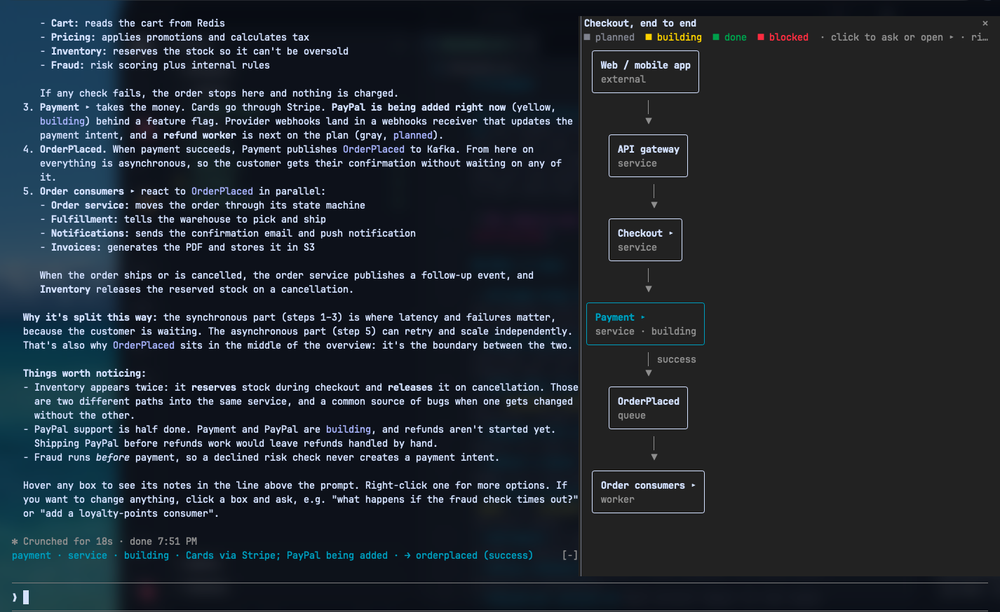
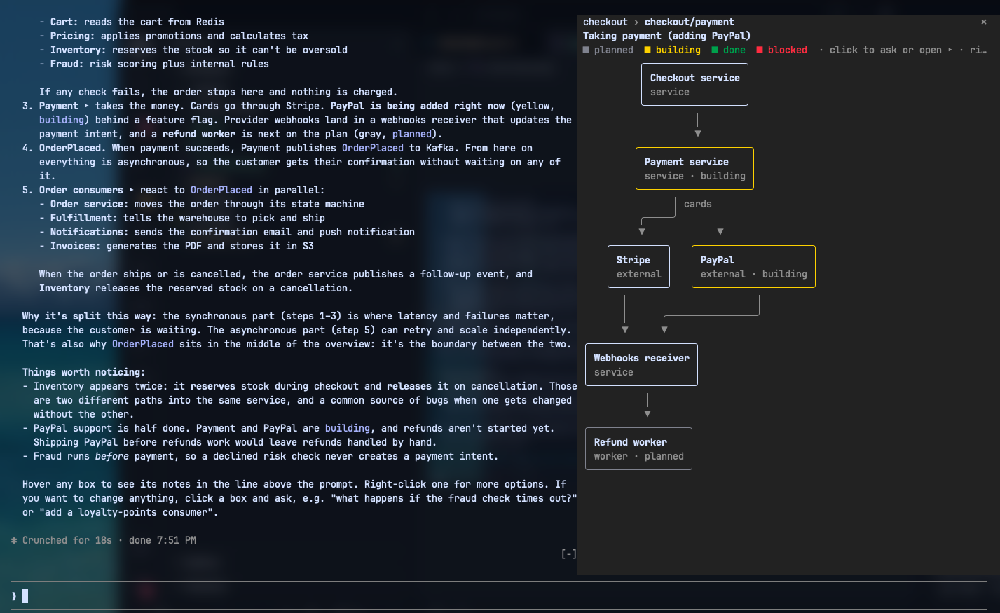

# archpane

**A live architecture diagram in a side pane of Claude Code.** Ask Claude to diagram a system and it draws it in a pane next to the chat, then keeps it current while you talk. You can click into components, ask about them, and watch a build plan go from planned to done. The diagram never gets buried in the transcript.



## What it does

- **Claude draws the diagram, you keep talking.** "Diagram how checkout works", then "add a fraud check before payment" or "mark the worker as done". The pane updates in place.
- **Big systems become subdiagrams.** Claude draws a short overview, and each stage marked **▸** opens its own detail diagram when you click it. A breadcrumb at the top leads back.
- **Ask about any component.** Click a box (one without ▸) to put `[diagram <name>: <id>]` in your prompt, then type your question. Claude looks the component up in the diagram.
- **Right-click a box** for a menu: ask about it, open its detail, or copy its id.
- **Hover a box** to see its kind, group, note and outgoing edges in a line above the prompt.
- **Track a build.** Components can be `planned`, `building`, `done` or `blocked`, shown by color. Claude updates them as the work lands.
- **Groups** of components belonging to one stage are drawn inside a labeled border.
- **Drag sideways** to pan a wide diagram. The mouse wheel scrolls it vertically.
- **Saved per project.** Each project keeps its own named diagrams across sessions.
- **Plain text.** It's drawn with box-drawing characters, not images, so it doesn't depend on a terminal's graphics support.



## Requirements

- **Claude Code 2.1.288 or newer.** archpane is a Claude Code *mod* (a plugin of function hooks). Mods are an early-access feature whose API can change between releases. archpane is tested on 2.1.288.
- **A terminal that passes mouse events to Claude Code**, for clicking, dragging and right-clicking. Tested in Ghostty. Other terminals that report the mouse to applications should work too; reports are welcome.
- **Surfaces:** built for the terminal. The desktop app's Code tab and VS Code are covered by tests but haven't been tried live. VS Code shows a static drawing, with no panning or clicking.
- **For the docked pane:** Claude Code's fullscreen layout and a terminal at least 110 columns wide. Narrower than that, the pane shows inline above the prompt.

## Install

In Claude Code:

```
/plugin marketplace add facumarcet/archpane
/plugin install archpane@archpane
```

Restart Claude Code once if `/diagram` doesn't appear.

The first time Claude draws, Claude Code asks for permission to use the `diagram` tool. To skip that prompt, allow it in your settings (`~/.claude/settings.json`):

```json
{ "permissions": { "allow": ["mcp__archpane__diagram"] } }
```

## Use

```
/diagram              open the pane on this project's last diagram (or "main")
/diagram payments     switch to, or create, the diagram named "payments"
/diagram list         list this project's diagrams
```

Then ask Claude things like:

- "diagram the services in this repo and how they talk to each other"
- "draw how a request flows through the API, then let me drill into the auth step"
- "we're about to build X: put the plan in the diagram and update it as we go"

A plugin skill (`drawing-pane-diagrams`) teaches Claude how to author diagrams that read well in a narrow pane. After every edit, the tool tells Claude whether the diagram fits and what to fix if it doesn't.

## Update and uninstall

```
/plugin marketplace update archpane     # fetch the latest marketplace listing
/plugin update archpane@archpane        # then update the plugin
/plugin uninstall archpane@archpane
/plugin marketplace remove archpane
```

## Troubleshooting

- **The pane opens inline instead of beside the chat.** Use Claude Code's fullscreen layout and widen the terminal to 110 columns or more.
- **Clicks or right-clicks do nothing.** Your terminal has to pass mouse events to Claude Code. tmux isn't tested; try outside it first.
- **A dim `archpane: …` error line appears after an update.** Run `/diagram` once to redraw the pane. If it persists, please [open an issue](https://github.com/facumarcet/archpane/issues) with the line.

## How it works

| Piece | File |
| --- | --- |
| The `diagram` tool Claude calls (`get`, `set`, `patch`, `list`, `open`, `delete`), input checks, saving in the plugin store, the `/diagram` command, and the pane and breadcrumb | `hooks/register.tsx` |
| The diagram model and a layered (Sugiyama-style) layout: cycles reversed, long edges split into waypoints, crossing-reducing ordering sweeps, orthogonal routing in terminal cells, group borders, and the size review Claude reads after each edit | `hooks/lib.ts` |
| Painting boxes, edges, groups and the right-click menu into one character grid, sliced to the visible columns and drawn as rows of text runs | `hooks/draw.tsx` |
| The `Client` region that draws it, pans on drag, opens a subdiagram or asks about a box on click, and shows the right-click menu | `hooks/canvas.tsx` |
| How Claude should author diagrams for a narrow pane, including splitting a large system into an overview plus `<topic>/<stage>` detail diagrams | `skills/drawing-pane-diagrams/SKILL.md` |

A diagram is plain JSON: nodes `{ id, label, kind, group, status, note, detail }` and edges `{ from, to, label }`. Claude reads it back with `get` before answering questions about it, so the diagram, not the chat history, is the source of truth.

Diagrams are saved in Claude Code's plugin store on your machine, under your Claude Code config directory, keyed by the directory Claude Code was started in and the diagram name. Nothing is written to your repository. A git worktree, or a session started in a subdirectory, gets its own set of diagrams.

## Limits

- Diagrams live on your machine, not in the repo, so you can't share them with teammates yet.
- If two sessions edit the same diagram at once, the last save wins.
- Crossing reduction is heuristic, so dense graphs can still tangle. The authoring skill keeps diagrams small enough that this rarely matters.
- Boxes can't be moved by hand yet.
- A diagram has at most 100 components and 200 edges, and must be small enough to draw in a pane (the engine caps what a pane can draw). Claude gets told to split anything bigger.

## Development

```
git clone https://github.com/facumarcet/archpane.git
claude --plugin-dir ./archpane/plugins/archpane   # loads it in a session; hot-reloads on every edit
claude plugin test ./archpane/plugins/archpane
claude plugin validate ./archpane/plugins/archpane
```

When Claude Code loads the plugin, it writes the API's TypeScript types to `plugins/archpane/.claude-plugin/types/`, which is git-ignored. After that, `tsc -p plugins/archpane` type-checks it. CI runs `validate` and `test` on every pull request.

## License

MIT
