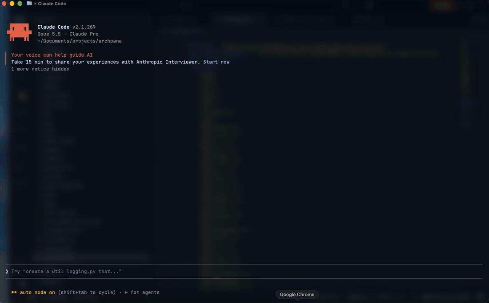

# archpane

**A live architecture diagram in a side pane of Claude Code.** Ask Claude to diagram a system and it draws it next to the chat, then keeps it current while you talk.



## What it does

- **Claude draws the diagram, you keep talking.** "Diagram how checkout works", then "add a fraud check before payment". The pane updates in place.
- **Big systems become subdiagrams.** A box marked **▸** opens a diagram of what happens inside it when you click it, and a breadcrumb leads back.
- **Ask about any component.** Click a box to put `[diagram <name>: <id>]` in your prompt, then type your question.
- **Track a build.** Components are `planned`, `building`, `done` or `blocked`, shown by color, and Claude updates them as the work lands.
- **Explore it with the mouse.** Hover for details, right-click for a menu, drag to pan.

## Requirements

- **Claude Code 2.1.288 or newer.** archpane is a Claude Code *mod*, and mods are an early-access feature whose API can change.
- **A terminal that passes mouse events to Claude Code.** Tested in Ghostty; reports from other terminals are welcome.
- **For the docked pane:** Claude Code's fullscreen layout, at least 110 columns wide. Narrower than that, it shows inline above the prompt.

## Install

```
/plugin marketplace add facumarcet/archpane
/plugin install archpane@archpane
```

Restart Claude Code once if `/diagram` doesn't appear. To skip the permission prompt the first time Claude draws, add `"mcp__archpane__diagram"` to `permissions.allow` in `~/.claude/settings.json`.

## Use

```
/diagram              open the pane on this project's last diagram (or "main")
/diagram payments     switch to, or create, the diagram named "payments"
/diagram list         list this project's diagrams
```

Then ask Claude, for example: "diagram the services in this repo and how they talk to each other", or "we're about to build X: put the plan in the diagram and update it as we go".

## How it works

A bundled skill teaches Claude to draw diagrams that read well in a narrow pane. After every edit, the tool tells Claude whether the diagram fits and what to fix if it doesn't. A diagram is plain JSON: nodes `{ id, label, kind, group, status, note, detail }` and edges `{ from, to, label }`.

Diagrams are saved on your machine, in Claude Code's plugin store, keyed by the directory Claude Code was started in. Nothing is written to your repository.

Details for contributors: [docs/ARCHITECTURE.md](docs/ARCHITECTURE.md).

## Troubleshooting

- **The pane opens inline instead of beside the chat.** Use the fullscreen layout and widen the terminal to 110 columns or more.
- **Clicks do nothing.** Your terminal has to pass mouse events to Claude Code. tmux isn't tested; try outside it first.
- **A dim `archpane: …` error line appears after an update.** Run `/diagram` once to redraw. If it persists, please [open an issue](https://github.com/facumarcet/archpane/issues).

## Limits

- Diagrams can't be shared with teammates yet, since they live on your machine.
- If two sessions edit the same diagram at once, the last save wins.
- Boxes can't be moved by hand yet.
- A diagram holds at most 100 components and 200 edges. Claude is told to split anything bigger.

## Update and uninstall

```
/plugin marketplace update archpane
/plugin update archpane@archpane
/plugin uninstall archpane@archpane
```

## Development

```
git clone https://github.com/facumarcet/archpane.git
claude --plugin-dir ./archpane/plugins/archpane   # hot-reloads on every edit
claude plugin test ./archpane/plugins/archpane
```

## License

MIT
